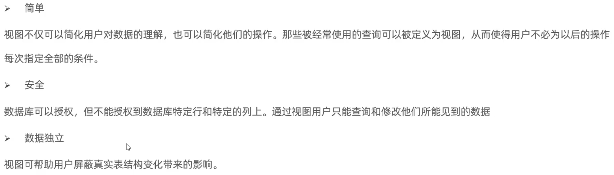

### 存储引擎

**体系结构图**


#### **存储引擎**

存储引擎就是存储数据、建立索引、更新/查询数据等技术的实现方式。存储引擎是基于表的，而不是基于库的，所以存储类型也可被称为表类型。

```sql
# 查询当前数据库支持的存储引擎
show engines;
# 创建表并指定引擎 [例]
create table my_myisam(
	id int
) engine = MyISAM;
```

**InnoDB引擎**

是一种兼顾高可靠性和高性能的通用存储引擎。

**特点**：DML操作遵循ACID（事务的四大特性）模型，**支持事务**；**行级锁**，提高并发访问性能；**支持外键**FOREIGN KEY约束，保证数据的完整性和正确性。

**InnoDB逻辑存储结构**

表空间、段、区、页、行


表空间中包含多段，段中包含多区，区中包含多页，也中包含多行。行指的就是我们在表中的一行一行。

每row行中就是事务的Id、指针、一个一个的字段。一个页16k，一个区1M最多包含64个页。

**MyISAM**

MyISAM是MySQL早期的默认存储引擎。特点：不支持事务，不支持外键；支持表锁，不支持行锁；访问速度快。

**Memory**

Memory引擎的表数据存在内存中，受硬件问题或断电问题影响，只能作为临时表或缓存使用。

特点：内存存放、hash索引（默认）

### 索引

索引：帮助MySQL高效获取数据的数据结构(有序)。


优点：提高数据检索的效率，降低数据库的IO成本。

​		通过索引对数据进行排序，降低数据排序的成本，降低CPU的消耗。

缺点：索引列也要占空间。

​		大大提高了查询效率，但降低了更新表的速度。

#### 索引结构


#### Btree

B+树相对于B树区别：

- 所有数据都会出现在叶子节点
- 叶子节点形成一个单向链表

B+树，数据的存储在叶子节点，索引节点不存储数据


#### hash索引

哈希索引就是采用一定的hash算法，将键值换算成新的hash值，映射到对应的槽位上，然后存储在hash表中。

链表可以解决hash冲突。不支持范围查询。

支持hash索引的是Memory引擎，InnoDB具有自适应hash功能。

**InnoDB存储引擎使用B+tree索引结构原因：**

- 相对于二叉树，层级更少，搜索销量高；
- 对于B-tree，无论叶子节点还是非叶子节点，都会保存数据，这样导致一页中存储的键值更少，指针跟着减少，要同样保存大量数据，只能增加树的高度，导致性能降低；
- 相对于hash索引，B+tree支持范围匹配及排序操作；

**索引分类**

主键索引(只能有一个)、唯一索引（可以避免同一个变种某数据列中的值重复）、常规索引、全文索引FULLTEXT


聚集索引、二级索引


聚集索引选取规则：

- 如果存在主键，主键索引就是聚集索引
- 如果不存在主键，将使用第一个唯一索引作为聚集索引。
- 如果没有主键，或没有合适的唯一索引，则InnoDB会自动生成一个rowid作为隐藏的聚集索引。

**回表查询**：先根据二级索引去找，找到对应的id值，再根据聚集索引值拿到对应的行数据。


#### 索引语法

```sql
# 创建索引
CREATE [UNIQUE|FULLTEXT] INDEX index_name ON table_name (index_col_name,字段名...);
# 查看索引
SHOW INDEX FROM table_name;
# 删除索引
DROP INDEX index_name ON table_name;
```

#### SQL性能分析

根据**SQL执行频率**，判断此类数据库以什么为主（增删改查）。

```sql
# 查当前数据库的INSERT、UPDATE等访问频次
SHOW GLOBAL STATUS LIKE 'Com_____';
# 查服务器状态
SHOW [SESSION | GLOBAL] STATUS;
```

**慢查询日志**,记录了所有执行时间超过指定参数（long_query_time，单位秒，默认10秒）等所有SQL语句的日志。

MySQL慢查询日志默认没有开启，需要在MySQL的配置文件（/etc/my.cnf）中配置如下信息：

```sql
# 查询慢查询日志是否开启
show variables like 'slow_query_log';
## 开启（在my.cnf）
### 开启慢日志查询开关
slow_query_log = 1
### 设置慢日志时间,超过该时间就是慢查询，记录慢查询日志
long_query_time = 2
```

**profile详情**:有些操作执行时间可能达到慢查询时间的左边缘，比如1.95秒，这类SQL也是相对性能较低的，我们也要对这部分SQL进行优化，如何定位到该处sql，慢查询日志满足不了。这时候就要用到profile详情。

show profiles 能够帮助我们了解时间都耗费到哪里去了，通过have_profiling参数,能看到当前数据库是否支持profile操作:```select @@have_profiling;```

```sql
# 查询是否支持profile操作
select @@have_profiling;
# 查询是否开启profiling
select @@profiling;
# 开启session/global级别的profiling
SET [SESSION|GLOBAL] profiling = 1;
# 查看sql耗时情况
SHOW profiles;
# 查看指定query_id的SQL语句各个阶段的耗时情况
SHOW profile FOR QUERY query_id;
# 查看置顶query_id的SQL语句CPU的使用情况
SHOW profile cpu FOR QUERY query_id;
```

**explain执行计划**，explain或者DESC命令获取mysql如何执行select语句的信息，包括在select语句执行过程中表如何连接和连接的顺序。

```sql
## 语法-直接在select语句之前加上关键字explain/desc
EXPLAIN SELECT 字段列表 FROM 表名 WHERE 条件;
```

explain查询到的执行计划每列的含义:


#### 索引使用

- 验证索引效率，在未建立索引之前，执行如下sql语句，查看sql的耗时。

```sql
# 根据id去查非常快
select * from tb_sku where id = 1;
# 根据sn查（sn这个字段没有索引，数据量多耗时很大）
select * from tb_sku where sn = '100000000003145001';
# 为sn字段创建索引(B+tree结构)
create index idx_sku_sn on tb_sku(sn);
# 再次执行select * from tb_sku where sn = '100000000003145001';耗时非常短
# 在select语句前加上explain可查看该语句执行计划
```

**索引使用法则--最左前缀法则**

该法则主要针对于联合索引。如果索引了多列（联合索引），要遵循最左前缀法则。最左前缀法则指的是查询从索引的最左列开始，并且不跳过索引中的列。如果跳过了某一列，**索引将部分失效（后面的字段索引失效）。**  

```sql
# profession、age、status是关联的索引，顺序依次是1、2、3
select * from tb_user where profession = '软件工程' and age = 31 and status = '0';
# 如果查的时候将age这个条件删除，将出现部分失效，最后面的status字段将失效。
# 如果查询的时候删除profession条件，将不再走索引查询，不满足最左前缀法则
```

**索引使用法则--索引失效情况**

- 索引列运算，不要在索引列上进行运算操作，否则索引将失效。

- 字符串类型字段使用时不加引号，索引将失效。

- 如果头部模糊匹配，索引将失效。（仅仅尾部模糊匹配，索引不会失效）

- 用or分割开的条件，如果or前的条件的列有索引，而后面的列中没有索引，那么涉及的索引都不会被用到。（只有两侧都有索引，索引才不会失效）
- 数据分布影响，如果mysql评估使用索引比全表更慢，则不适用索引。

**SQL提示**

简单来说，就是在SQL语句中加入一些人为的提示来达到优化操作的目的。

```sql
use index: # 告诉数据库用哪个索引
explain select * from tb_user use index(idx_user_pro) where profession = '软件工程';
ignore index: # 告诉数据库不要用哪个索引
explain select * from tb_user ignore index(idx_user_pro) where profession = '软件工程';
force index: # 告诉数据库必须走这个索引
explain select * from tb_user force index(idx_user_pro) where profession = '软件工程';
```

**覆盖索引**

尽量使用覆盖索引(其实就是select后面怎么写)，减少使用select *；

注（执行explain后extra中出现）：using index condition:查找使用了索引，但是需要回表查询数据

​		using where; using index:查找使用了索引，但是需要的数据在索引列中都能找到，所以不需要回表查询数据。

如下就是覆盖索引，需要查的在索引列中都能找到，不需要回表。


**前缀索引**


```sql
# 语法 # 此处n表示要提取字符串的前几个字符来构建索引
create index idx_xxx on table_name(column(n)); 
```

前缀长度的确定；


```sql
## 计算公式
select count(distinct email)/ count(*) from tb_user;
select count(distinct substring(email,1,5))/ count(*) from tb_user;
```


**单列索引&联合索引**

一个索引包含单个列；一个索引包含多个列；

先按phone来排序，若phone相同，再按name排序


#### 索引设计原则


### SQL优化

#### 插入优化

```sql
# 插入多条--批量插入(一次性插入的数据不建议超过1000条)
insert into tb_test values (1,'Tom'),(2,'Cat');
# 手动事务提交,正常执行完一条插入语句后，就自动提交了，建议开启手动提交，全部执行完毕后再提交
start transaction;
insert into tb_test values (1,'Tom'),(2,'Cat');
insert into tb_test values (3,'Jerry'),(4,'Tom');
insert into tb_test values (5,'Cat'),(4,'Jerry');
commit;
# 主键顺序插入(顺序插入性能要高于乱序插入)

# 大批量插入数据，insert语句性能较低，mysql提供了load指定进行插入。（load加载本地文件到数据库表）
select @@local_infile;#查询是否开启
```


#### 主键优化

**数据组织方式**，在InnoDB存储引擎中，表数据都是根据主键顺序组织存放的，这种存储方式的表称为索引组织表。

**页分裂**（主键乱序插入可能发生该现象），页可以为空，也可以填充一半，也可以填充100%。每个页中包含2-N行数据（如果一行数据过大，会行溢出），根据主键排列。

**页合并**

合并页阈值：merge_threshold可以自己设置，创建表或者索引时指定。


**主键设计原则**


#### order by优化


#### group by 优化

在分组操作时，可以通过索引来提高效率。

在分组操作时，索引的使用要满足最左前缀法则。

#### limit优化

大数据量情况下，越往后耗时越长。

优化思路：一般分页查询时，通过创建 覆盖索引 能比较好地提高性能，可以通过覆盖索引加子查询形式进行优化。

#### count优化

count的几种方法


count(*)、count(主键)、count(字段)会判断数据是否是null，如果不是null则计数加1、count(1)

#### update优化

更新语句时，不提交的话会将整行锁住。（行级锁）

更新的条件为其他字段（不为索引字段）会锁整个表（表锁）。

更新字段时一定要根据索引字段进行更新。

### 视图/存储过程/触发器

#### 视图

视图是一种虚拟存在的表，视图中的数据并不在数据库中实际存在。

视图只保存了查询的SQL逻辑，不保存查询结果。在创建视图时，主要工作就落在创建这条SQL查询语句上。

```sql
# 创建--如下：视图是一张虚拟表，最终的数据来源于后面的select语句 
CREATE [OR REPLACE] VIEW 视图名称[(列名列表)] AS SELECT语句 [WITH [CASCADED | LOCAL] CHECK OPTION]
## 例
create or replace view stu_v_1 as select id,name from student where id <= 10;
# 查看视图
## 查看创建视图的语句
SHOW CREATE VIEW 视图名称;
## 查看视图数据
SELECT * FROM 视图名称...;
# 修改视图
create or replace view stu_v_1 as select id,name, no from student where id <= 10;#直接覆盖
alter view stu_v_1 as select id,name, no from student where id <= 10;#方式2
# 删除视图
drop view if exists stu_v_1;
```

 往视图插入数据，数据会存入表中。

检查选项：


- cascaded:当视图基于一个视图创建，添加此条件后，两个视图的条件都会去检查。即会检查当前视图和当前视图依赖的所有视图。
- local:  定义v1（不添加），基于v1定义v2视图并添加with local check option,基于v2视图定义v3视图（不添加）。此时向v1插入数据是不会检查条件的，向v2添加数据会检查v2的条件，然后去看v1是否添加了检查条件，如果添加了则去校验，如果没有就不去校验。

**更新及作用**


作用：


