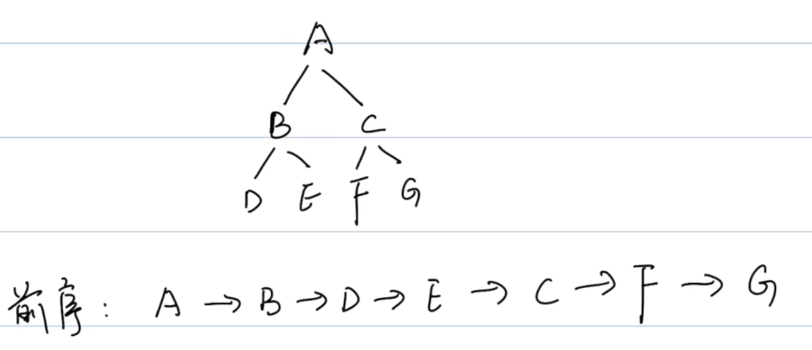
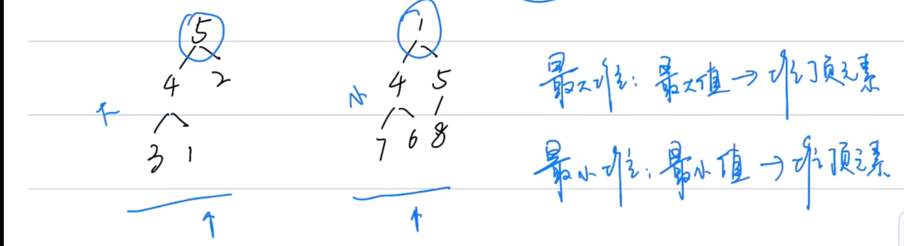
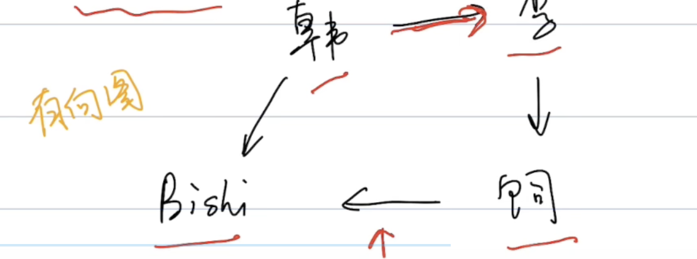
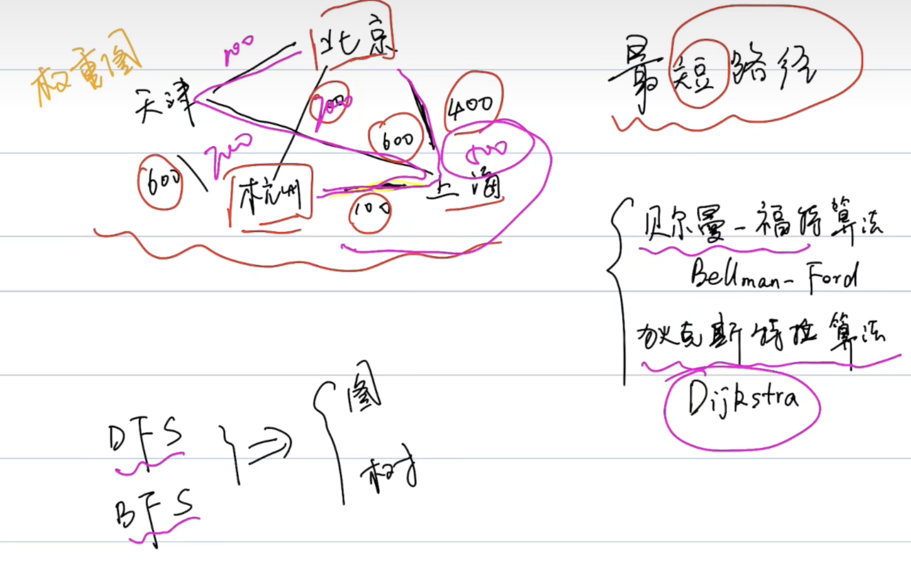

#### 基础概念（树）

- 节点（每一个元素都是节点）、叶子节点（没有孩子的节点 ）、根节点（最上面那个）；

- 高度：从下往上看的；深度：从上往下看；

- 普通二叉树：每个节点最多两个孩子

- 满二叉树：除了叶子节点，每个节点都有左右两个孩子,另外所有的叶子节点必须在同一层

- 完全二叉树：从树的根节点，从上到下从左到右依次填满节点形成的二叉树

- 二叉树的遍历

  - 前序遍历：根-->左-->右
  - 中序遍历：左-->根-->右
  - 后序遍历：左-->右-->根

    

中序：D-->B-->E-->A-->F-->C-->G

后序：D-->E-->B-->F-->G-->C-->A

#### heap堆

**是堆的条件：**

- 首先是完全二叉树
- 每个节点的值 >=或者<=孩子节点



**复杂度：**

- 访问 x
- 搜索（堆顶元素）o(1),其他元素是o(N)
- 添加 o(logN)
- 删除 o(logN)

**堆化**，一组数先转换成完全二叉树，再改造成最大堆或最小堆

**堆的常用操作**

java创建堆要用到java.util包下的PriorityQueue这个方法

```java
//创建最小堆
PriorityQueue<Integer> minheap = new PriorityQueue<>();
//创建最大堆(最小堆元素顺序反转)
PriorityQueue<Integer> maxheap = new PriorityQueue<>(Collections.reverseOrder());
//添加元素
maxheap.add(1);
//取堆顶元素
maxheap.peek();
//删除堆顶元素并返回这个元素
maxheap.poll();
//size
maxheap.size();
//遍历堆，边删除边遍历
while(!minheap.isEmpty()){
  sout(minheap.poll());
}
```

#### 题[215. 数组中的第K个最大元素](https://leetcode.cn/problems/kth-largest-element-in-an-array/)

堆排序：

```java
class Solution {
    public int findKthLargest(int[] nums, int k) {
        PriorityQueue<Integer> maxheap = 
        new PriorityQueue<>(Collections.reverseOrder());
        for(int i = 0; i<nums.length;i++){
            maxheap.add(nums[i]);
        }
        for(int j = k-1;j >0; j--){
            maxheap.poll();
        }
        return maxheap.peek();
    }
}
```

简单排序：

```java
class Solution {
    public int findKthLargest(int[] nums, int k) {
        Arrays.sort(nums);
        return nums[nums.length - k];
    }
}
```

#### 图

一个节点有几个边，则这个节点度就是几。

无向图

有向图

- 入度：多少边指向该顶点
- 出度：多少边从这个点为起点指向别的顶点



权重图 

